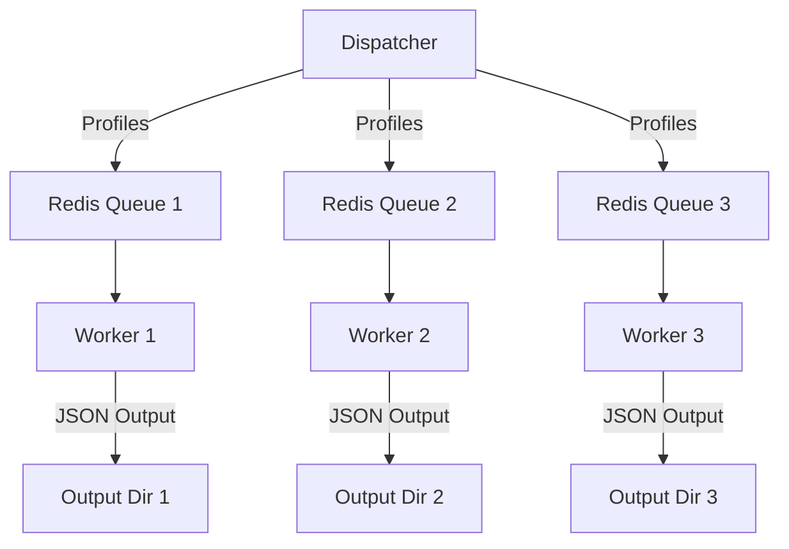

# Profile Generator for MiraStral Fine-Tuning

This project implements a distributed system for generating high-quality training data to fine-tune MiraStral, focusing on professional profile analysis and personality insights. The system leverages multiple LLMs and diverse prompting strategies to create a rich, varied dataset that captures different perspectives on professional personality analysis.

## Architecture Overview

The system uses a distributed architecture with three main components:

1. **Dispatcher** (`dispatcher.py`): Distributes LinkedIn profiles across multiple Redis queues
2. **Workers** (`prompt.py`): Process profiles using different LLMs
3. **Redis Queue**: Acts as a reliable message broker between components



## Purpose and Methodology

### Data Generation Strategy

The system employs multiple strategies to ensure high-quality, diverse training data:

1. **Multiple Models**: Different LLMs are used to generate varied perspectives:
   
   - **Qwen-32B** (`qwen3:32b`)
     - Large 32B parameter model
     - Strong multilingual capabilities
     - Excellent at structured output
   
   - **Gemma-27B** (`gemma3:27b`)
     - Google's 27B parameter model
     - Strong reasoning capabilities
     - Good at professional analysis
   
   - **Olmo-13B** (`olmo2:13b`)
     - 13B parameter model
     - Open source and highly customizable
     - Efficient for text analysis tasks
   
   - **Phi-14B** (`phi4:14b`)
     - Microsoft's 14B parameter model
     - Specialized in professional content
     - Strong at structured reasoning

   Each model brings unique strengths to the analysis:
   - Different training backgrounds
   - Varied reasoning approaches
   - Diverse linguistic patterns
   - Complementary analytical styles

2. **Diverse Prompting**: Each profile is analyzed using randomly selected prompts from different professional perspectives:
   - Executive Coach
   - HR Director
   - Headhunter
   - Corporate Psychologist
   - Leadership Consultant
   - And many more...

3. **Structured Output**: All responses are formatted as JSON with consistent fields:
   - Personality traits
   - Communication style
   - Professional vibe category
   - Confidence scores
   - Key strengths and growth areas
   - Radar data for various professional attributes

### Fine-Tuning Purpose

The generated dataset will be used to fine-tune MiraStral for:
1. Professional personality analysis
2. Career coaching and development
3. Team dynamics understanding
4. Leadership potential assessment

The diverse perspectives and structured outputs help MiraStral learn:
- Different ways to analyze professional profiles
- Various professional assessment frameworks
- Consistent output structuring
- Confidence-based assessments

## Technical Implementation

### Redis Queue System

The project uses Redis as a distributed message queue for several reasons:
- **Reliability**: Ensures no profiles are lost during processing
- **Scalability**: Easy to add more workers and queues
- **Performance**: In-memory operations for fast message passing
- **Persistence**: Optional persistence for crash recovery

### Worker Distribution

Workers are designed to:
- Process profiles independently
- Use consistent model endpoints
- Generate unique filenames with timestamps
- Save outputs to separate directories

### Running the System

Basic usage:
```bash
./run.sh <model_name>
```

Example:
```bash
./run.sh qwen:32b
```

This will start:
- 1 dispatcher with 3 queues
- 3 workers processing different queues
- All using the specified model

## Output Format

Each analysis is saved as a JSON file with the format:
```json
{
  "messages": [
    {
      "role": "user",
      "content": "Profile analysis request..."
    },
    {
      "role": "assistant",
      "content": {
        "personality_traits": ["trait1", "trait2", "trait3", "trait4", "trait5"],
        "communication_style": "Analytical",
        "vibe_category": "Leader",
        "confidence_score": 85,
        "key_strength": "Strong strategic thinking and execution abilities",
        "growth_area": "Could develop more collaborative leadership approaches",
        "radar_data": [
          {"trait": "Leadership", "score": 83},
          {"trait": "Innovation", "score": 76},
          {"trait": "Empathy", "score": 89},
          {"trait": "Analytics", "score": 74},
          {"trait": "Communication", "score": 82}
        ]
      }
    }
  ]
}
```

## Dependencies

- Redis server
- Python packages (see requirements.txt):
  - redis
  - pandas
  - requests

## Future Improvements

1. Add support for more models
2. Implement automated quality checks
3. Add result aggregation and analysis tools
4. Enhance prompt diversity
5. Add model response validation 